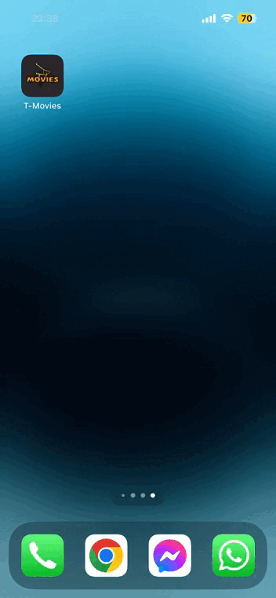

# T-Movies-iOS

T-Movies is an iOS application with many features to get the last movies, and people feedback.

# Features

In the app there is many feature and components, we found :

## Carousel of the trending movies
A carousel of movies in the home screen

## List of movies with categories & searching

## Profile

## Setting

## Side Menu

